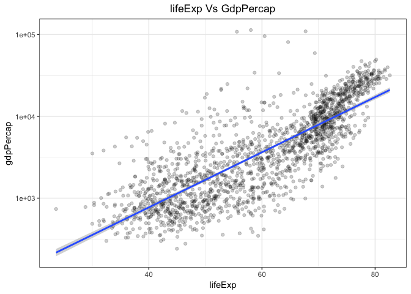
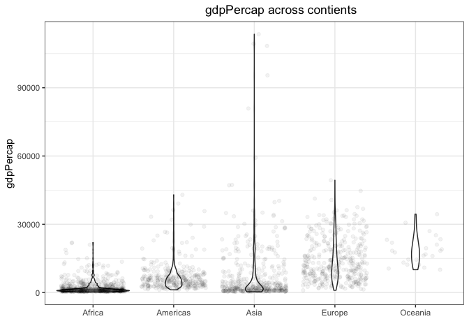

[](https://github.com/STAT545-UBC-students/hw07-rasiimwe/blob/master/logo/logo.png)

nplots
======

Overview
--------

**nplots** is an R package that generates various plots without you worrying about writing multiple lines of code or the details of the application of the The Grammar of Graphics when creating plots. The background machinery of `nplots` is based off of **ggplot** and takes care of all the code required to generate a plot. All you need to do is specify plot arguments and you are good to go!

`nplots` comes with two preliminary functions, `nplots_scatter()` and `nplots_violin()` that help you generate scatter plots and violin plots respectively. To use these functions, you provide the data, plot aesthetics and arguments like the plot title and x and y labels. You can also specify other parameters like the alpha and hjust values, you can specify whether you would like to have geom\_jitter in a plot or whether you would like the plot converted into plotly!!! Please visit [this vignette](https://github.com/STAT545-UBC-students/hw07-rasiimwe/blob/master/vignettes/nplots_vignette.Rmd) on details of usage

Installation
------------

The released version of nplots is available and can easily be installed from github with:

``` r
#this is the nplots development version from Github
install.packages("nplots")
devtools::install_github("STAT545-UBC-students/hw07-rasiimwe/nplots")

#also install the following required packages
install.packages("gapminder")
install.packages("ggplot2")
install.packages("plotly")
install.packages("tidyverse")
```

Load required libraries

``` r
library(nplots)
library(gapminder)
library(ggplot2)
library(plotly)
library(tidyverse)
```

Usage
-----

When using ggplot, you will normally work with the structure of the below code:

``` r
#creating a dataset to work with
mean_lifeExp_cont <- gapminder %>% 
  group_by(continent, year) %>% 
  summarise(mean_lifeExp = mean(lifeExp))

mp_plot <- mean_lifeExp_cont %>% 
  ggplot(aes(year, mean_lifeExp, color = continent)) +
  geom_line(size = 0.5) +
  scale_color_manual(values = continent_colors) + 
  geom_point(shape = 3, stat = 'summary', fun.y = sum) +
  stat_summary(fun.y = sum, geom = "line") + 
  theme_bw() +
  scale_x_continuous(breaks = mean_lifeExp_cont$year) +
  labs(title = "Mean life expectancy of each continent over the years") +
  theme(plot.title = element_text(hjust = 0.5))
```

The purpose of nplots is to save you the trouble of writing or re-writing the numerous lines of code :point\_up\_2: that generate a plot whenever you need to generate a similar plot.

### Example1: Generating a Scatter plot using `nplots_scatter()`

This is a basic example which shows how to create a scatter plot:

``` r
nplots_scatter(gapminder, gapminder$lifeExp, gapminder$gdpPercap, xlab="lifeExp", ylab="gdpPercap", title="lifeExp Vs GdpPercap", plotly=FALSE, alpha=0.19, hjust=0.5)
```



### Example2: Generating a Violin plot using `nplots_violin()`

This is a basic example which shows how to create a violin plot:

``` r
nplots_violin(gapminder, gapminder$gdpPercap, gapminder$continent, jitter=TRUE, order=TRUE, xlab="", ylab="gdpPercap", title="gdpPercap across contients", plotly=FALSE, alpha=0.05, hjust=0.6)
```



Getting help
------------

-   If you are completely new to visualizations using ggplot2 and would like some preliminary tutorials in the application of ggplot2, please visit [Data visualisation with ggplot2](https://www.datacamp.com/courses/data-visualization-with-ggplot2-1) by Rick Scavetta on DataCamp.
-   Another helpful resource is [The R Graphics Cookbook](http://amzn.to/2dVfMfn) by Winston Chang.

-   For more help or inquirues on learning more about visualizations and rendering plots of choice, please visit the friendly [RStudio community](https://community.rstudio.com/).

-   [Stack Overflow](http://stackoverflow.com/questions/tagged/ggplot2?sort=frequent&pageSize=50) is another great and vibrant platform for asking questions, getting involved in discussion and providing solutions to other questions asked on the platform. Great place to learn!!

For Developers
--------------

nplots is based on the ggplots2 and was developed to provide plot generation functions without a user worrying about the details of [The Grammar of Graphics](http://amzn.to/2ef1eWp). This is version 0.1.0 and includes two plot types. Future versions will incorporate other plot types like line, box, column e.t.c
